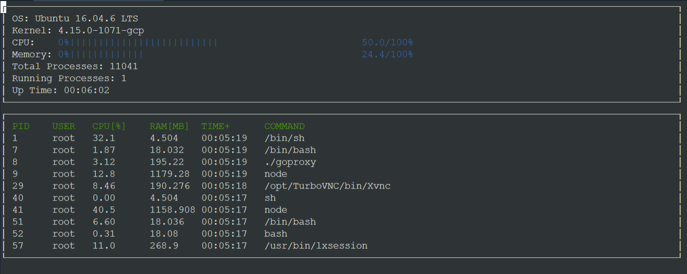
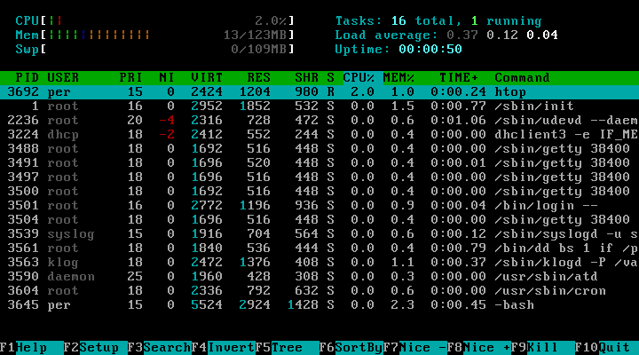

# Linux System Resource Monitor

An object-oriented, terminal-based system resource monitor for Linux, inspired by `htop`.

This project demonstrates core systems programming concepts in C++ by directly parsing the Linux virtual filesystem (`/proc`) to track real-time hardware utilization and process metrics. It avoids heavy external monitoring libraries and instead relies on low-level file I/O, string manipulation, and system-level data structures to render a live snapshot of the operating system's state.

## 📸 Demo



*Reference: Standard `htop` environment*



## ✨ Core Features

* **System Metrics:** Tracks real-time CPU utilization, total/free memory allocation, and system uptime.
* **Process Tracking:** Monitors active processes, including individual PID, user IDs, command execution strings, memory consumption, and per-process CPU utilization.
* **Zero-Dependency Parsing:** Custom parser built to read and tokenize raw data directly from `/proc/meminfo`, `/proc/stat`, and `/proc/[pid]/` directories.
* **Terminal UI:** Responsive, text-based graphical interface built with `ncurses`.

## 🏗️ Architecture & Code Structure

The repository follows standard C++ project conventions by separating declarations (`include/`) from implementations (`src/`).

### Parsing Engine

* **`src/linux_parser.cpp`** and **`include/linux_parser.h`**
  Handle file stream operations using `std::ifstream` to read data from the `/proc` filesystem. The parser uses `std::string` manipulation and regular expressions to extract critical system information, such as CPU statistics and process data.

### Object-Oriented Models

* **`src/system.cpp`**
  Acts as the master container for the application. It aggregates CPU, memory, operating system, and process information and manages the collection of active processes.

* **`src/process.cpp`**
  Represents a single running process. It encapsulates the logic required to calculate process CPU usage over time, determine memory consumption, retrieve process information, and sort processes based on resource usage through operator overloading.

* **`src/processor.cpp`**
  Models the CPU and stores previous CPU state information to calculate the difference between active and idle CPU time across refresh cycles.

### Utilities & Display

* **`src/format.cpp`**
  Provides utility functions for converting raw system uptime in seconds into a human-readable `HH:MM:SS` format.

* **`src/ncurses_display.cpp`**
  Connects the backend data models with the terminal-based frontend. It initializes the `ncurses` interface, continuously retrieves updated data from the `System` object, and renders CPU/memory information and process tables.

## ⚙️ Dependencies

The project requires the following:

* **Linux Environment:** The project relies on the Linux `/proc` filesystem and will not run natively on Windows or macOS. WSL or a Linux virtual machine can be used on those platforms.
* **CMake:** Version 3.7 or higher
* **Make:** Version 4.1 or higher
* **GCC/G++:** Version 5.4 or higher
* **ncurses:** Required for the terminal-based user interface.

### Installing ncurses

For Ubuntu/Debian:

```bash
sudo apt install libncurses5-dev libncursesw5-dev
```

## 🚀 Build & Run Instructions

The project uses **CMake** and **Make** for the build process.

### 1. Clone the Repository

```bash
git clone https://github.com/YourUsername/System-Resource-Monitor.git
cd System-Resource-Monitor
```

### 2. Create a Build Directory

```bash
mkdir build
cd build
```

### 3. Compile the Project

```bash
cmake ..
make
```

### 4. Run the Executable

```bash
./monitor
```

## 🛠️ Additional Makefile Targets

If you prefer using the provided wrapper `Makefile` in the root directory, the following commands are available:

| Command       | Description                                                 |
| ------------- | ----------------------------------------------------------- |
| `make build`  | Compiles the source code and generates the executable.      |
| `make format` | Applies ClangFormat to enforce consistent code formatting.  |
| `make debug`  | Compiles the project with debugging symbols (`-g`) enabled. |
| `make clean`  | Removes the `build/` directory and compiled artifacts.      |

## 🗺️ Roadmap / Future Enhancements

Planned features to improve performance and usability:

* **Multithreaded Architecture:** Separate the `/proc` parsing engine from the UI rendering loop using `std::thread` and `std::mutex` for improved concurrency.
* **Network Sockets:** Implement a basic TCP endpoint for remotely querying system statistics and returning the data as a JSON payload.

## 📁 Project Structure

```text
.
├── include/
│   ├── linux_parser.h
│   ├── process.h
│   ├── processor.h
│   └── system.h
├── src/
│   ├── format.cpp
│   ├── linux_parser.cpp
│   ├── ncurses_display.cpp
│   ├── process.cpp
│   ├── processor.cpp
│   └── system.cpp
├── images/
│   ├── monitor.png
│   └── HTOP.png
├── CMakeLists.txt
├── Makefile
└── README.md
```

## 💡 Concepts Demonstrated

* Object-Oriented Programming in C++
* Linux `/proc` virtual filesystem
* File I/O using `std::ifstream`
* String parsing and regular expressions
* CPU utilization calculation using jiffies
* Process monitoring and resource tracking
* Operator overloading
* CMake-based project configuration
* Makefile-based build automation
* Terminal UI development using `ncurses`
* Linux system-level programming
